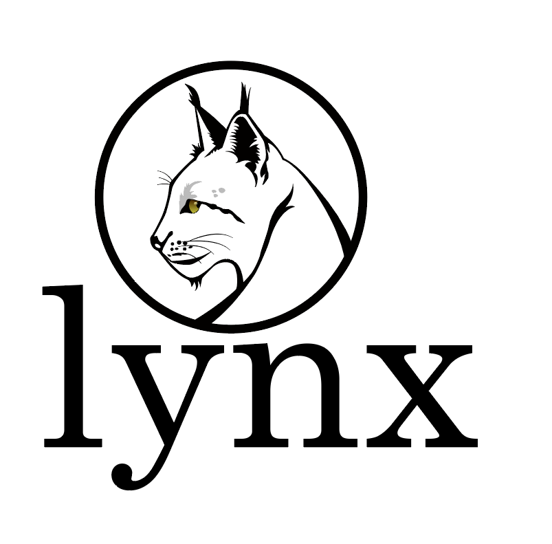

<!-- Improved compatibility of back to top link: See: https://github.com/othneildrew/Best-README-Template/pull/73 -->
<a name="readme-top"></a>
<!--
*** Thanks for checking out the Best-README-Template. If you have a suggestion
*** that would make this better, please fork the repo and create a pull request
*** or simply open an issue with the tag "enhancement".
*** Don't forget to give the project a star!
*** Thanks again! Now go create something AMAZING! :D
-->


<!-- PROJECT SHIELDS -->
<!--
*** I'm using markdown "reference style" links for readability.
*** Reference links are enclosed in brackets [ ] instead of parentheses ( ).
*** See the bottom of this document for the declaration of the reference variables
*** for contributors-url, forks-url, etc. This is an optional, concise syntax you may use.
*** https://www.markdownguide.org/basic-syntax/#reference-style-links
-->
[![Contributors][contributors-shield]][contributors-url]
[![Forks][forks-shield]][forks-url]
[![Stargazers][stars-shield]][stars-url]
[![Issues][issues-shield]][issues-url]
[![MIT License][license-shield]][license-url]

<!-- PROJECT LOGO -->
<br />
<div align="center">
  <a href="https://github.com/lynxworld/lynx">
    
  </a>

<h3 align="center">Lynx: A Graph Query Framework for Multiple Heterogeneous Data Sources</h3>

  <p align="center">
    Lynx is a general graph query framework to simplify querying graph data by converting complex statements into basic graph operations. Instead of connecting directly to the data sources, Lynx retrieves data through user-implemented interfaces for those graph operations. 
    <br />
<!--     <a href="https://github.com/lynxworld/lynx"><strong>Explore the docs »</strong></a> -->
    <br />
    <br />
    <a href="https://www.youtube.com/watch?v=bFhMIkksMl8">View Demo</a>
    ·
    <a href="https://github.com/lynxworld/lynx/issues">Report Bug</a>
    ·
    <a href="https://github.com/lynxworld/lynx/issues">Request Feature</a>
  </p>
</div>


<!-- TABLE OF CONTENTS -->
<details>
  <summary>Table of Contents</summary>
  <ol>
    <li>
      <a href="#about-the-project">About The Project</a>
      <ul>
        <li><a href="#built-with">Built With</a></li>
      </ul>
    </li>
    <li>
      <a href="#getting-started">Getting Started</a>
      <ul>
        <li><a href="#prerequisites">Prerequisites</a></li>
        <li><a href="#installation">Installation</a></li>
      </ul>
    </li>
    <li><a href="#usage">Usage</a></li>
    <li><a href="#roadmap">Roadmap</a></li>
    <li><a href="#contributing">Contributing</a></li>
    <li><a href="#license">License</a></li>
    <li><a href="#contact">Contact</a></li>
    <li><a href="#acknowledgments">Acknowledgments</a></li>
  </ol>
</details>


<!-- ABOUT THE PROJECT -->
## About The Project
### Intruduction

<p align="right">(<a href="#readme-top">back to top</a>)</p>

### Architecture and Workflow

<!-- GETTING STARTED -->
## Getting Started

### Import
Import Lynx by Maven.
```xml
  <dependency>
      <groupId>org.grapheco</groupId>
      <artifactId>lynx</artifactId>
      <version>0.6</version>
  </dependency>
```

### How to use

1. Implementa
2. Runner

<p align="right">(<a href="#readme-top">back to top</a>)</p>


## Demo Video
We have a demo video at VLDB2023:
[](https://www.youtube.com/watch?v=bFhMIkksMl8 "Lynx")

<!-- Citation -->
## Citation
Our paper has been accepted as a demo paper at VLDB2023:
```
@article{shen2023lynx,
  title={Lynx: A Graph Query Framework for Multiple Heterogeneous Data Sources},
  author={Shen, Zhihong and Hu, Chuan and Zhao, Zihao},
  journal={Proceedings of the VLDB Endowment},
  volume={16},
  number={12},
  pages={3926--3929},
  year={2023},
  publisher={VLDB Endowment}
}
```

<!-- ACKNOWLEDGMENTS -->
<!-- ## Acknowledgments

* []()
* []()
* []()

<p align="right">(<a href="#readme-top">back to top</a>)</p> -->


<!-- MARKDOWN LINKS & IMAGES -->
<!-- https://www.markdownguide.org/basic-syntax/#reference-style-links -->
[contributors-shield]: https://img.shields.io/github/contributors/lynxworld/lynx.svg?style=for-the-badge
[contributors-url]: https://github.com/lynxworld/lynx/contributors
[forks-shield]: https://img.shields.io/github/forks/lynxworld/lynx.svg?style=for-the-badge
[forks-url]: https://github.com/lynxworld/lynx/network/members
[stars-shield]: https://img.shields.io/github/stars/lynxworld/lynx.svg?style=for-the-badge
[stars-url]: https://github.com/lynxworld/lynx/stargazers
[issues-shield]: https://img.shields.io/github/issues/lynxworld/lynx.svg?style=for-the-badge
[issues-url]: https://github.com/lynxworld/lynx/issues
[license-shield]: https://img.shields.io/github/license/lynxworld/lynx.svg?style=for-the-badge
[license-url]: https://github.com/lynxworld/lynx/blob/master/LICENSE

[scala]: https://img.shields.io/badge/scala-000000?style=for-the-badge&logo=scala&logoColor=white&labelColor=%23DC322F
[scala-url]: https://nextjs.org/


